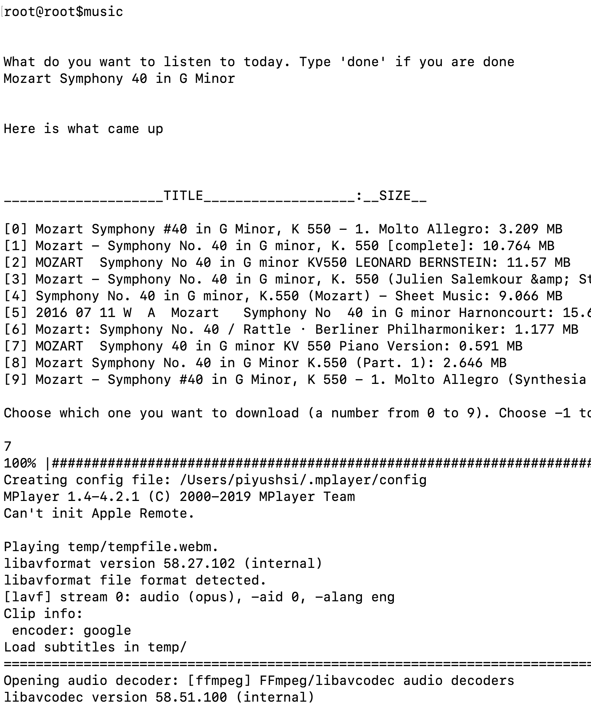

This is a tool to play YouTube music from Terminal.


#### Usage:
```
git clone https://github.com/piyush-kgp/terminal-music
cd terminal-music
pip3 install -r requirements.txt
touch config.py
```
Now, go into `config.py` and add these lines:
```
class Config:
    api_key = "your_key"
```
Go to [GCP console](http://console.cloud.google.com), create a project (or using an existing project), enable YouTube data API and obtain API key. Then replace `your_key` with your actual key.

You will also need to install a music player. For this you can ` brew install mplayer`(MacOS) or `apt-get install mplayer`(Ubuntu).

You should now be able to run:
```
python3 main.py
```

Bonus: Add this line to your `~/.bashrc`(Ubuntu) or `~/.bash_profile`(MacOS) to be able to run this from anywhere:
```
export music="cd $location/terminal-music && python3 main.py"
```

Replace `$location` with your actual location where you cloned this repo.


Here is how it looks like  on my Terminal:


